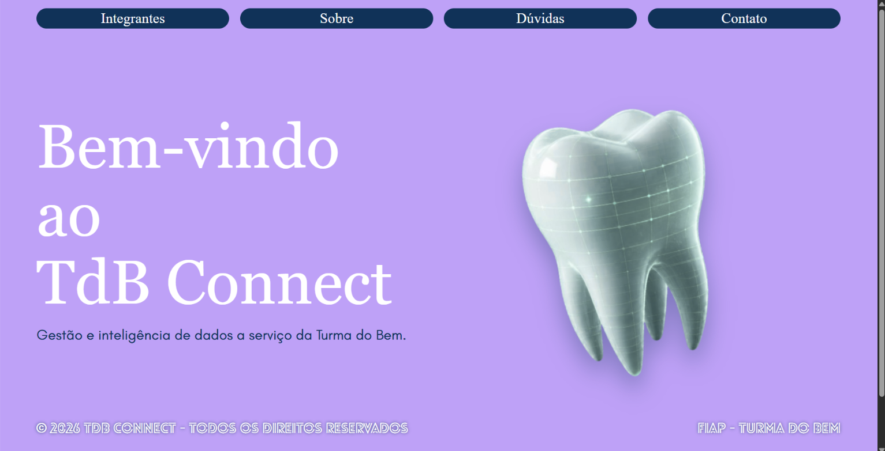
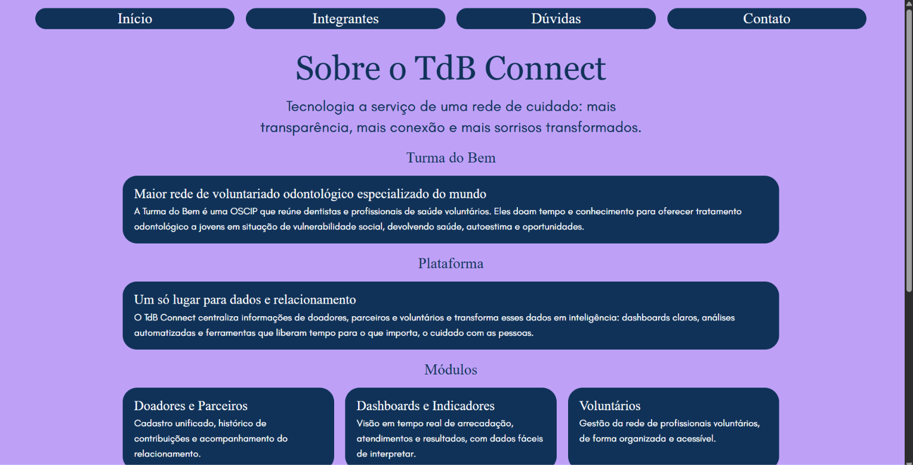
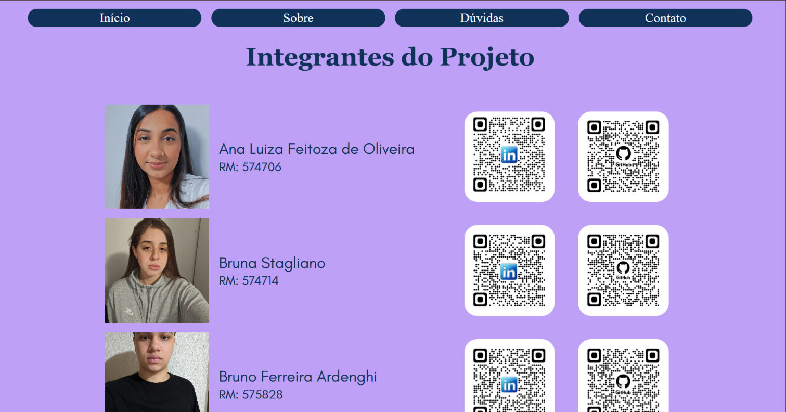
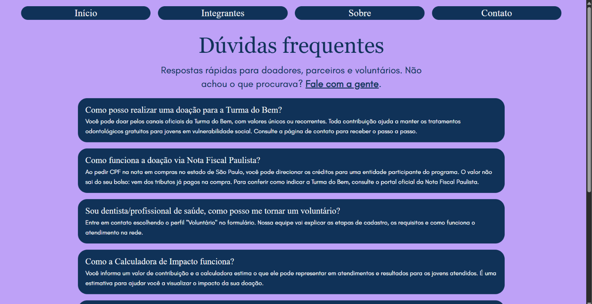
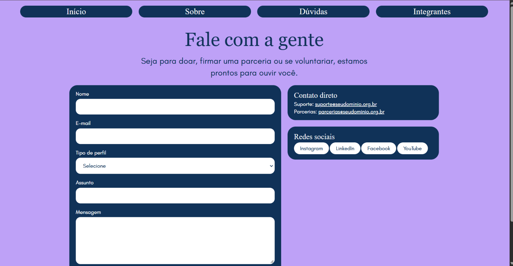
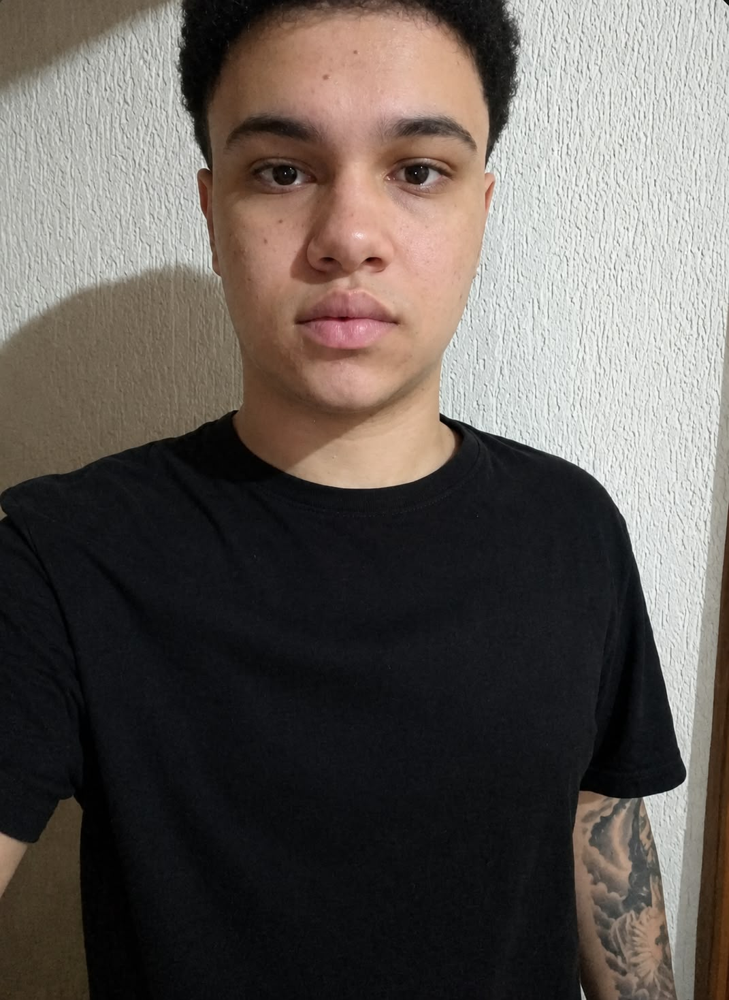
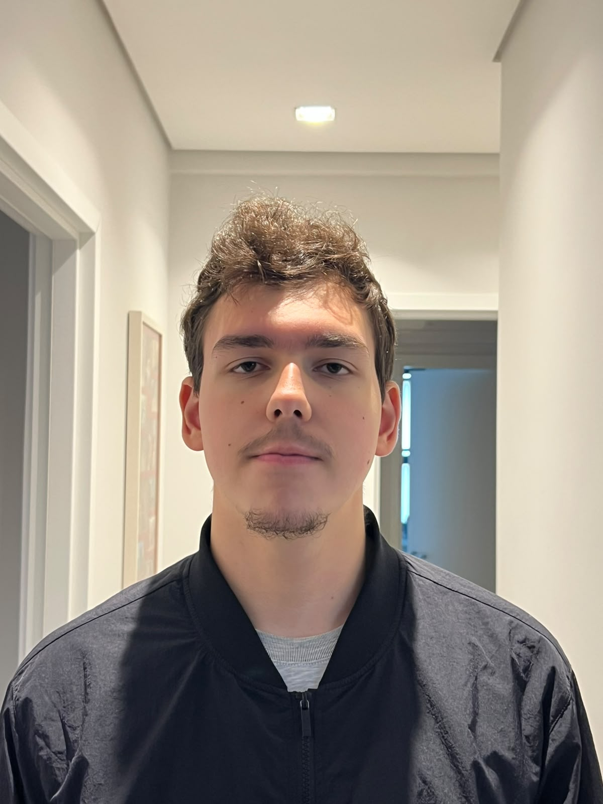

#TdB Connect
> Tecnologia a serviço de uma rede de cuidado: mais transparência, mais conexão e mais sorrisos transformados.

## 1. Descrição
O **TdB Connect** é um site institucional criado como projeto acadêmico da **FIAP** em parceria com a **Turma do Bem**, a maior rede de voluntariado odontológico especializado do mundo. A Turma do Bem é uma OSCIP que reúne dentistas e profissionais de saúde voluntários para oferecer tratamento odontológico a jovens em situação de vulnerabilidade social.
 
O projeto apresenta uma plataforma que centraliza dados de doadores, parceiros e voluntários e os transforma em informação útil. Os módulos apresentados são:
 
- Doadores e Parceiros
- Dashboards e Indicadores
- Voluntários
- Calculadora de Impacto
- Assistente Virtual
A proposta de valor se apoia em três pilares: **transparência**, **automação** e **inclusão**.
 
**Páginas do site:** Início, Sobre, Integrantes, Dúvidas (FAQ) e Contato.

## 2. Tecnologias Utilizadas
| Tecnologia | Uso |
|---|---|
| HTML5 | Estrutura semântica das páginas |
| CSS3 | Estilização, com variáveis CSS (`:root`), reset próprio e nomenclatura BEM |
| Fontes locais (`@font-face`) | Glacial Indifference e Lovelo Line, hospedadas em `assets/fonts/` |
| Git e GitHub | Controle de versão e hospedagem do código |
| Visual Studio Code | Ambiente de desenvolvimento |
 
**Sem frameworks ou bibliotecas externas:** o projeto não usa Bootstrap, Material UI, Chakra UI, jQuery, CDNs nem Google Fonts. Todo o CSS foi escrito pela equipe.

## 3. Estrutura de pastas
 
```
tdb-connect/
├── index.html              # Página inicial
├── README.md               # Documentação do projeto
├── pages/
│   ├── sobre.html
│   ├── integrantes.html
│   ├── faq.html
│   └── contato.html
├── css/
│   ├── reset.css           # Reset de estilos do navegador
│   ├── variaveis.css       # Cores, espaçamentos e demais variáveis
│   ├── global.css          # Fontes locais e estilos compartilhados
│   └── pages.css           # Estilos específicos das páginas
└── assets/
    ├── fonts/              # Glacial Indifference e Lovelo Line (.otf)
    └── img/                # Imagens do site, fotos e ícones dos integrantes
```
## 4. Como executar
 
1. Baixe ou clone o repositório.
2. Abra o arquivo `index.html` em qualquer navegador.
Não é necessário instalar nada nem rodar servidor.

## 5. Imagens do Projeto


 



 





## 6. Autores
 
<!-- PREENCHER: nome completo, RM, turma, foto e links de cada integrante -->
 
| Foto | Nome | RM | Turma | LinkedIn | GitHub |
|---|---|---|---|---|---|
|  | Ana PREENCHER | PREENCHER | PREENCHER | [LinkedIn](https://www.linkedin.com/in/ana-feitoza-3460252b3) | [GitHub](https://github.com/AnaFeitoza1) |
|  | Bruna PREENCHER | PREENCHER | PREENCHER | [LinkedIn](PREENCHER) | [GitHub](PREENCHER) |
|  | Bruno PREENCHER | PREENCHER | PREENCHER | [LinkedIn](PREENCHER) | [GitHub](PREENCHER) |
|  | Rafael PREENCHER | PREENCHER | PREENCHER | [LinkedIn](PREENCHER) | [GitHub](PREENCHER) |
|  | Yohan PREENCHER | PREENCHER | PREENCHER | [LinkedIn](PREENCHER) | [GitHub](PREENCHER) |

## 7. Repositório
 
Código-fonte público: **https://github.com/AnaFeitoza1/tdb-connect**

 ## 8. Contato
 
Dúvidas ou suporte sobre o projeto? Fale com a equipe:
 
- Página de contato do site: `pages/contato.html`
- Ana PREENCHER: PREENCHER (e-mail ou LinkedIn)
- Bruna PREENCHER: PREENCHER (e-mail ou LinkedIn)
- Bruno PREENCHER: PREENCHER (e-mail ou LinkedIn)
- Rafael PREENCHER: PREENCHER (e-mail ou LinkedIn)
- Yohan PREENCHER: PREENCHER (e-mail ou LinkedIn)

